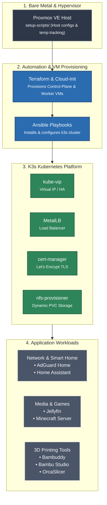

# homelab-infra
Repo to house my infrastructure for my homelab 


## Architecture

### System Architecture Overview



---

### Network Flow Architecture

```mermaid
flowchart TD
    %% Custom Styling
    classDef client fill:#1e293b,stroke:#475569,stroke-width:2px,color:#fff;
    classDef edge fill:#0f766e,stroke:#14b8a6,stroke-width:2px,color:#fff;
    classDef lb fill:#1d4ed8,stroke:#3b82f6,stroke-width:2px,color:#fff;
    classDef k8s fill:#334155,stroke:#64748b,stroke-width:2px,color:#fff;
    classDef storage fill:#b45309,stroke:#f59e0b,stroke-width:2px,color:#fff;

    subgraph CLIENTS ["Client Layer"]
        LAN_CLIENTS["Local LAN Clients / Devices"]:::client
    end

    subgraph INGRESS_LAYER ["Network Ingress & IP Management"]
        DNS["AdGuard Home<br><small>DNS Resolution / Ad Blocking</small>"]:::edge
        VIP["kube-vip<br><small>Control-Plane HA / API Virtual IP</small>"]:::lb
        MLB["MetalLB<br><small>Service LoadBalancer IP Pool</small>"]:::lb
        CERT["cert-manager<br><small>Let's Encrypt TLS Termination</small>"]:::edge
    end

    subgraph CLUSTER_VMS ["K3s Node Network (Proxmox VMs)"]
        direction TB
        CP_NODES["K3s Control-Plane Node(s)"]:::k8s
        WORKER_NODES["K3s Worker Node(s)"]:::k8s
    end

    subgraph STORAGE_NET ["Storage Layer"]
        NFS_SERVER["NFS Server / NAS"]:::storage
        NFS_PROV["nfs-provisioner<br><small>K3s Dynamic StorageClass</small>"]:::storage
    end

    subgraph K8S_SERVICES ["Exposed Services & Applications"]
        direction LR
        SVC_HOME["Home Assistant<br><small>Web UI / IoT Traffic</small>"]:::k8s
        SVC_MEDIA["Jellyfin / Minecraft<br><small>Media Streaming & Gaming</small>"]:::k8s
        SVC_PRINT["Bambu Stack<br><small>Bambuddy / Studio / OrcaSlicer</small>"]:::k8s
    end

    %% Networking Flow
    LAN_CLIENTS -->|DNS Queries :53| DNS
    LAN_CLIENTS -->|kubectl / K8s API Traffic| VIP
    LAN_CLIENTS -->|App HTTP/HTTPS/TCP Traffic| MLB

    VIP --> CP_NODES
    MLB --> CERT
    CERT --> K8S_SERVICES

    CP_NODES <-->|Flannel / CNI Overlay| WORKER_NODES
    WORKER_NODES --- K8S_SERVICES

    K8S_SERVICES -.->|Persistent Volumes (RWX/RWO)| NFS_PROV
    NFS_PROV <-->|NFS Protocol :2049| NFS_SERVER
```
