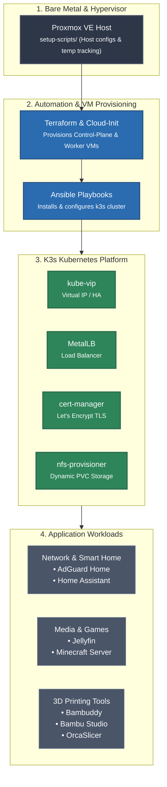

# homelab-infra
Repo to house my infrastructure for my homelab 

## Architecture Overview

```mermaid
flowchart TD
    %% Custom Styling
    classDef hypervisor fill:#2d3748,stroke:#4a5568,stroke-width:2px,color:#fff;
    classDef infra fill:#2b6cb0,stroke:#2c5282,stroke-width:2px,color:#fff;
    classDef platform fill:#2f855a,stroke:#276749,stroke-width:2px,color:#fff;
    classDef app fill:#4a5568,stroke:#718096,stroke-width:1px,color:#fff;

    subgraph Layer1 ["1. Bare Metal & Hypervisor"]
        PVE["Proxmox VE Host<br><small>setup-scripts/ (Host configs & temp tracking)</small>"]:::hypervisor
    end

    subgraph Layer2 ["2. Automation & VM Provisioning"]
        TF["Terraform & Cloud-Init<br><small>Provisions Control-Plane & Worker VMs</small>"]:::infra
        ANS["Ansible Playbooks<br><small>Installs & configures k3s cluster</small>"]:::infra
    end

    subgraph Layer3 ["3. K3s Kubernetes Platform"]
        VIP["kube-vip<br><small>Virtual IP / HA</small>"]:::platform
        MLB["MetalLB<br><small>Load Balancer</small>"]:::platform
        CERT["cert-manager<br><small>Let's Encrypt TLS</small>"]:::platform
        NFS["nfs-provisioner<br><small>Dynamic PVC Storage</small>"]:::platform
    end

    subgraph Layer4 ["4. Application Workloads"]
        direction LR
        APP_NET["Network & Smart Home<br>• AdGuard Home<br>• Home Assistant"]:::app
        APP_MEDIA["Media & Games<br>• Jellyfin<br>• Minecraft Server"]:::app
        APP_PRINT["3D Printing Tools<br>• Bambuddy<br>• Bambu Studio<br>• OrcaSlicer"]:::app
    end

    %% Flow Connections
    PVE --> TF
    TF --> ANS
    ANS --> Layer3
    Layer3 --> Layer4
```
